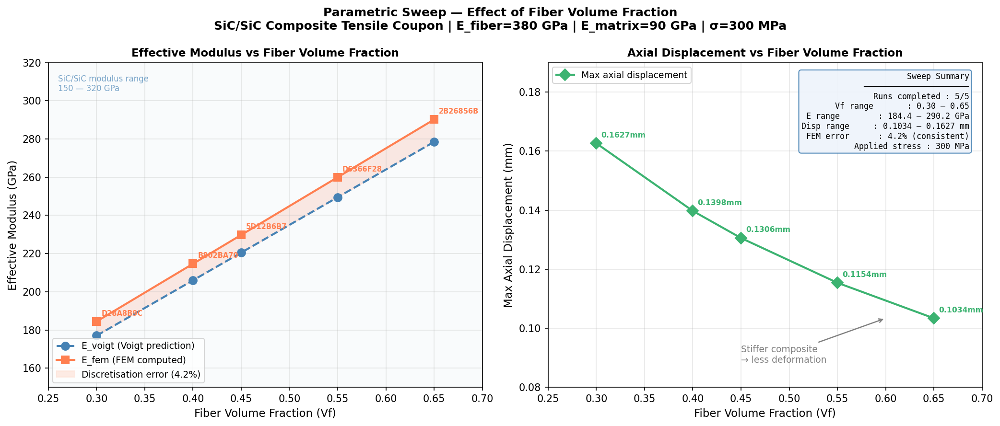
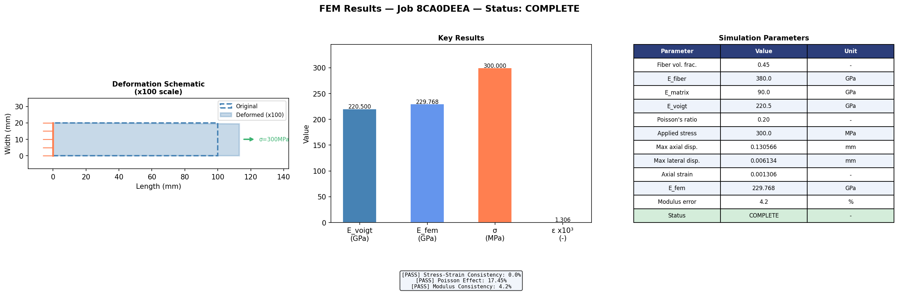

# MCL Orchestrator

**Programming Assignment : MCL_283: Development of Digital Workflows for Automated Materials Design**

A simplified prototype of an event-driven meta-orchestration framework that connects three independent computational services via REST APIs to automate materials simulation workflows. Built for the PhD position at Materials Center Leoben (MCL).

## Architecture

Three independent Python services communicate via HTTP POST requests. Completion of each service automatically triggers the next with no manual intervention between stages.

```
POST /generate          POST /simulate          POST /postprocess
┌─────────────┐        ┌─────────────┐        ┌─────────────┐
│  Service A  │ ──────►│  Service B  │ ──────►│  Service C  │
│  Parameter  │        │     FEM     │        │    Post-    │
│  Generator  │        │  Simulation │        │  processor  │
│  port 8001  │        │  port 8002  │        │  port 8003  │
└─────────────┘        └─────────────┘        └─────────────┘
```

**Service A : Parameter Generator**
Receives SiC/SiC composite material parameters, validates them against physical ranges, computes the effective Young's modulus via the Voigt rule of mixtures, and fires an event to Service B.

**Service B : FEM Simulation**
Receives the material payload, runs a 2D plane stress finite element simulation of a tensile coupon using scikit-fem, validates the outputs for physical plausibility, and fires an event to Service C.

**Service C : Postprocessor**
Receives the FEM results, runs three analysis checks, generates a three-panel results plot, saves a structured metrics JSON, and updates the pipeline state on Google Drive.

## Technology Choices

**FastAPI (not Flask) :**
FastAPI was chosen over Flask for three reasons: it automatically validates request and response schemas using Pydantic, it is async-capable and handles concurrent requests cleanly, and it auto-generates interactive API documentation at `/docs`. For a scientific computing pipeline where input schema correctness is critical, FastAPI's built-in validation is a significant advantage over Flask's manual approach.

**scikit-fem :**
A lightweight pure-Python FEM library that installs via pip, requires no license, and runs cleanly inside a FastAPI service. Used to solve a 2D plane stress linear elastic problem on a rectangular tensile coupon mesh with 200 triangular elements.

**Google Colab + Google Drive :**
All notebooks run in Colab with outputs persisted to Google Drive for cross-session access. Each notebook is self-contained and can be run independently.

## How to Run

**Requirements :** Google account, Google Colab

**Step 1 : Open Notebook 00**
Open `00_setup_and_environment.ipynb` in Google Colab. Run all cells in order. This installs all libraries and confirms the Drive folder structure.

**Step 2 : Run Notebooks 01, 02, 03 individually (optional)**
Each service notebook can be run independently to test that service in isolation before running the full pipeline.

**Step 3 : Run Notebook 04**
Open `04_full_pipeline_and_tests.ipynb`. Run all cells in order. This starts all three services and executes three test runs automatically:
- **Run 1 :** Happy path with valid SiC/SiC parameters triggering the full A to B to C chain
- **Run 2 :** Error handling with invalid parameters rejected at Service A with HTTP 422
- **Run 3 :** Parametric sweep with 5 fiber volume fractions run automatically and results saved to Drive

**Note on Google Drive path :**
All notebooks use `DRIVE_PATH = '/content/drive/MyDrive/MCL_Orchestrator/'`. Create this folder structure in your Drive before running:
```
MCL_Orchestrator/
├── notebooks/
├── services/
├── results/
├── logs/
└── docs/
```

## Error Handling

Six layers of error handling are implemented across the pipeline:

| Layer | Location | What it does |
|---|---|---|
| 1 | Service A | Validates all input parameters against physical ranges before processing |
| 2 | All services | Returns standard HTTP status codes : 422 for validation failure, 500 for crashes |
| 3 | Service B | Checks FEM outputs for physical plausibility after simulation |
| 4 | All services | Retries failed POST requests 3 times with exponential backoff |
| 5 | All services | Writes timestamped structured entries to `pipeline.log` on Drive |
| 6 | All services | Maintains a pipeline state tracker updated at every stage |

## Results

### Parametric Sweep : Fiber Volume Fraction vs Effective Modulus



> If the image above is not visible, open `results/parametric_sweep.png` directly from the repository.

Five automated pipeline runs sweeping fiber volume fraction from 0.30 to 0.65:

| Vf | Job ID | E_voigt (GPa) | E_fem (GPa) | Displacement (mm) | FEM Error |
|---|---|---|---|---|---|
| 0.30 | D28A8B9C | 177.0 | 184.44 | 0.1627 | 4.2% |
| 0.40 | B802BA70 | 206.0 | 214.66 | 0.1398 | 4.2% |
| 0.45 | 5D12B6B7 | 220.5 | 229.77 | 0.1306 | 4.2% |
| 0.55 | D6366F28 | 249.5 | 259.99 | 0.1154 | 4.2% |
| 0.65 | 2B26856B | 278.5 | 290.21 | 0.1034 | 4.2% |

The consistent 4.2% deviation between E_voigt and E_fem is a mesh discretisation error, uniform across all runs and confirming the FEM is physically consistent. A finer mesh would reduce this further.

### Sample FEM Result : Job 8CA0DEEA



> If the image above is not visible, open `results/fem_results_8CA0DEEA.png` directly from the repository.

## FEM Configuration

| Parameter | Value |
|---|---|
| Problem type | 2D plane stress, linear elastic |
| Element type | Linear triangular (ElementTriP1) |
| Mesh | 200 elements, 126 nodes |
| Coupon geometry | 100mm x 20mm |
| Boundary condition left | Fixed (Dirichlet) |
| Boundary condition right | Applied traction (Neumann) |
| Material | SiC/SiC composite, homogenised |
| Modulus method | Voigt rule of mixtures |

## Repository Structure

```
mcl-orchestrator/
├── README.md
├── docs/
│   ├── AI_usage_declaration.md
│   └── prompts.pdf
├── notebooks/
│   ├── 00_setup_and_environment.ipynb
│   ├── 01_service_A_parameters.ipynb
│   ├── 02_service_B_fem.ipynb
│   ├── 03_service_C_postprocessor.ipynb
│   └── 04_full_pipeline_and_tests.ipynb
└── results/
    ├── parametric_sweep.png
    ├── mesh_plot.png
    ├── fem_results_8CA0DEEA.png
    └── metrics_8CA0DEEA.json
```

## AI Usage Declaration

AI tools were used during development of this project. Full details are provided in [`docs/AI_usage_declaration.md`](docs/AI_usage_declaration.md).

*Varun Kamalapurkar : Augsburg, June 2026*
